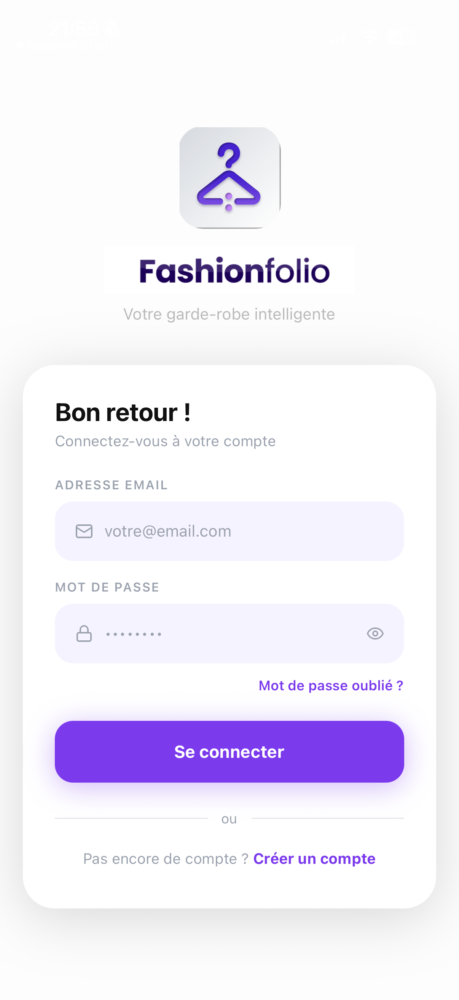
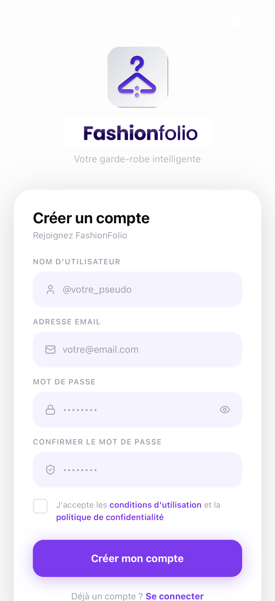
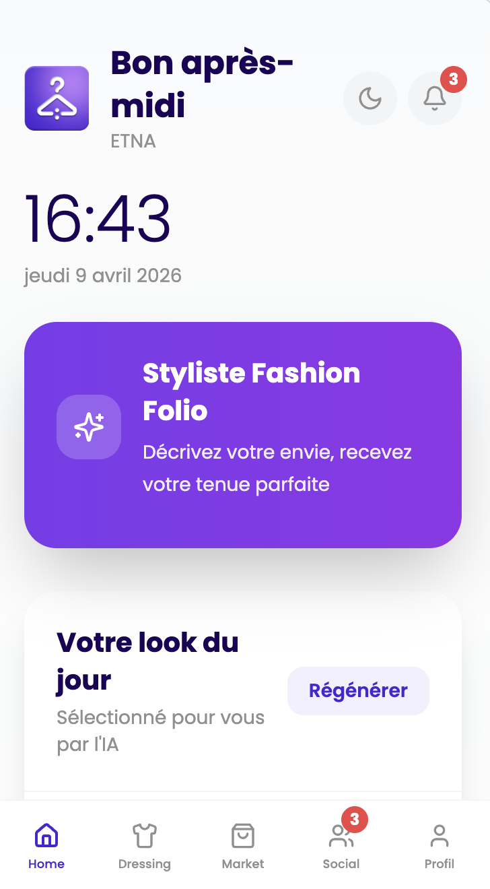
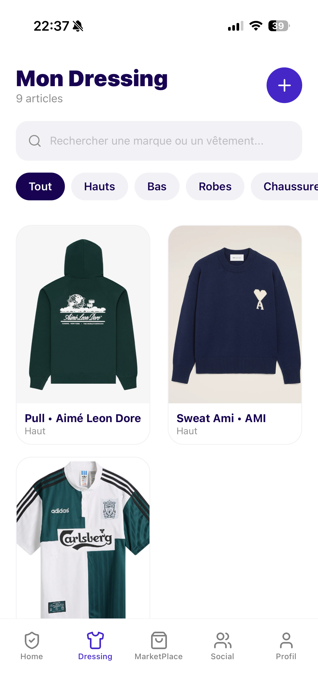
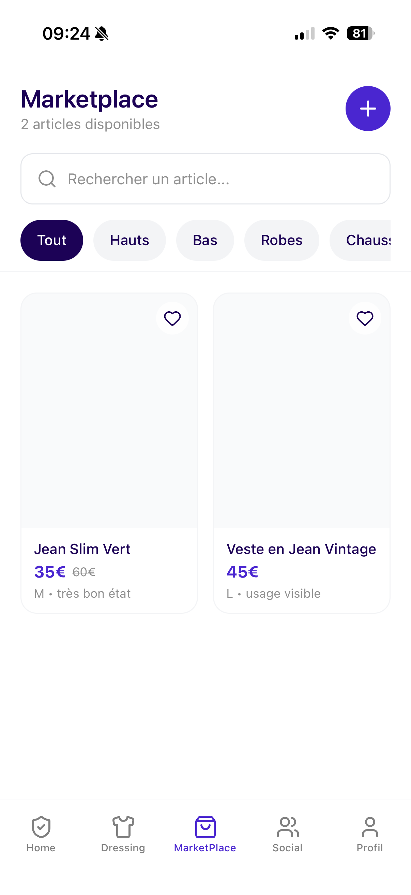
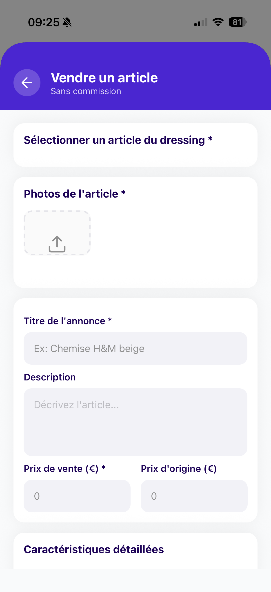
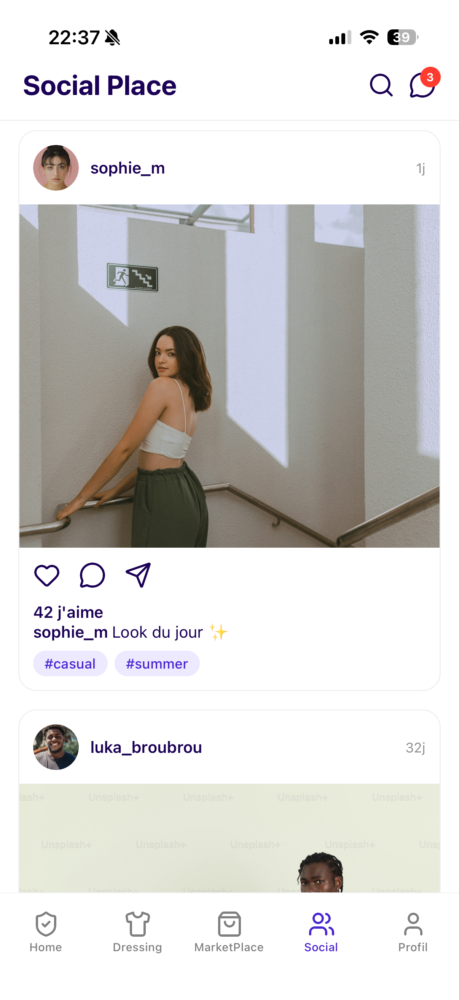
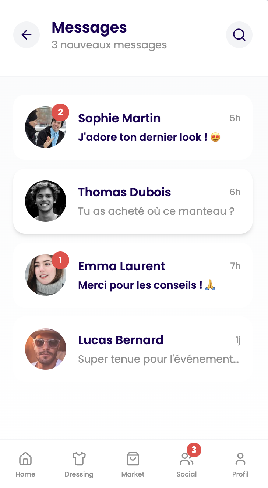
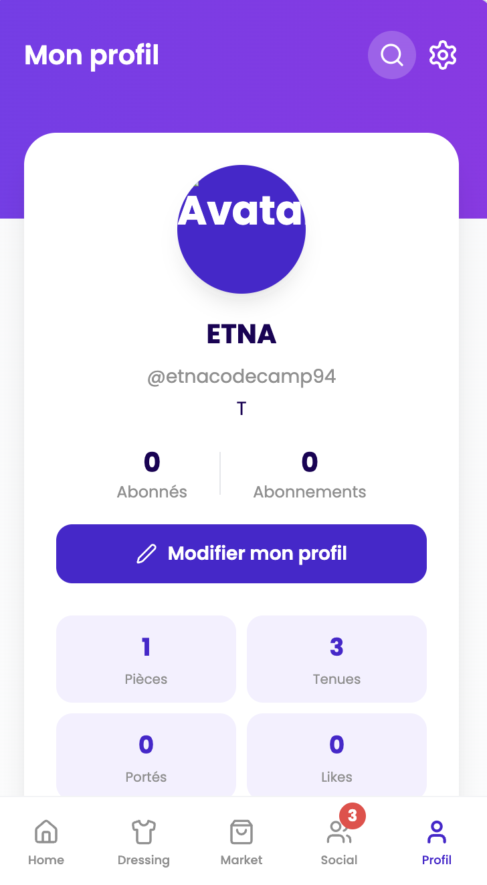

<div align="center">


# 👗 Fashionfolio

### _Votre dressing connecté. Votre marketplace. Votre communauté._

**Une application mobile hybride qui réinvente la façon dont les passionnés de mode gèrent, partagent et vendent leurs vêtements.**

<br/>

[](https://reactnative.dev/)
[](https://expo.dev/)
[](https://fastapi.tiangolo.com/)
[](https://www.python.org/)
[](https://jwt.io/)
[](https://www.sqlite.org/)
[](LICENSE)
[]()

</div>

---

## 📋 Table des matières

1. [Présentation](#-présentation)
2. [Aperçu de l'application](#-aperçu-de-lapplication)
3. [Fonctionnalités](#-fonctionnalités)
4. [Stack technique](#️-stack-technique)
5. [Architecture de navigation](#️-architecture-de-navigation)
6. [Installation & Lancement](#-installation--lancement)
7. [Structure du projet](#-structure-du-projet)
8. [Notes techniques](#-notes-techniques)
9. [Équipe](#-équipe)

---

## 🎯 Présentation

**Fashionfolio** est une application mobile hybride — _Dressing connecté_ + _Marketplace_ + _Réseau Social_ — conçue pour les passionnés de mode.

Elle est née de la refonte complète d'un template web React (base44), entièrement repensé et adapté en application mobile native avec **React Native** et **Expo**.

|                     🗄️ Numérisez votre garde-robe                     |                    🛍️ Achetez & vendez sans commission                     |                      🤝 Rejoignez la communauté                      |
| :-------------------------------------------------------------------: | :------------------------------------------------------------------------: | :------------------------------------------------------------------: |
| Cataloguez chaque pièce avec photos, catégories, couleurs et saisons. | Publiez vos articles directement depuis votre Dressing, sans frais cachés. | Partagez vos looks, explorez des feeds et échangez en message privé. |

---

## 📸 Aperçu de l'application

### Authentification & Accueil

|                                                        Login                                                         |                                                           Register                                                           |                                                        Home                                                         |
| :------------------------------------------------------------------------------------------------------------------: | :--------------------------------------------------------------------------------------------------------------------------: | :-----------------------------------------------------------------------------------------------------------------: |
|  |  |  |
|                                           _Connexion sécurisée par JWT_                                              |                                               _Création de compte_                                                           |                                          _Tableau de bord utilisateur_                                              |

### Mon Dressing

|                                                             Grille du Dressing                                                              |
| :-----------------------------------------------------------------------------------------------------------------------------------------: |
|  |
|                                                        _Vue en grille des pièces_                                                           |

### Marketplace

|                                                           Parcourir les articles                                                           |                                                          Mettre en vente                                                          |
| :----------------------------------------------------------------------------------------------------------------------------------------: | :--------------------------------------------------------------------------------------------------------------------------------: |
|  |  |
|                                                       _Grille + moteur de recherche_                                                       |                                                    _Vente depuis le Dressing_                                                      |

### Social & Profil

|                                                          Feed Social                                                          |                                                              Messagerie                                                             |                                                        Profil                                                         |
| :---------------------------------------------------------------------------------------------------------------------------: | :---------------------------------------------------------------------------------------------------------------------------------: | :-------------------------------------------------------------------------------------------------------------------: |
|  |  |  |
|                                                     _Fil communautaire_                                                       |                                                      _Conversations privées_                                                        |                                              _Gestion du profil & abonnement_                                         |

---

## ✨ Fonctionnalités

### 🔐 Authentification

- Inscription et connexion sécurisées
- Authentification par token **JWT**
- Persistance de session

### 🏠 Home

- Tableau de bord personnalisé à l'arrivée de l'utilisateur

### 👔 Mon Dressing

- **Affichage en grille** de tous les vêtements de l'utilisateur
- **Système de filtres** par catégories
- **Ajout d'un vêtement** (`AddClothingScreen`) :
  - Upload de photo directement depuis la galerie ou l'appareil photo
  - Sélection via **Chips interactifs** : catégorie, couleur, saison
  - Formulaire complet de description

### 🛒 Marketplace _(sans commission)_

- Grille d'articles en vente avec **moteur de recherche** intégré
- **Vue détaillée** d'un article (`ListingDetailsScreen`)
- **Formulaire de mise en vente** (`SellItemScreen`) :
  - Possibilité de piocher directement un vêtement existant depuis son Dressing
  - Publication instantanée d'une annonce

### 🌐 Espace Social

- **Feed communautaire** : exploration des posts de la communauté
- **Centre de messagerie** :
  - Liste des conversations DM (`DMList`)
  - Interface de conversation privée (`DMConversation`)

### 👤 Profil

- Gestion des informations personnelles de l'utilisateur
- Gestion de l'**abonnement** (Subscription)

---

## 🛠️ Stack technique

### Frontend Mobile

| Technologie             | Rôle                                                |
| ----------------------- | --------------------------------------------------- |
| **React Native**        | Framework mobile cross-platform                     |
| **Expo** (SDK 52)       | Toolchain, build et accès aux APIs natives          |
| **React Navigation**    | Navigation (Bottom Tabs + Native Stack)             |
| **lucide-react-native** | Bibliothèque d'icônes                               |
| **StyleSheet natif**    | Design system custom (aucune dépendance UI externe) |
| **React Context API**   | Gestion d'état global (ex: `MarketplaceContext`)    |
| **expo-image-picker**   | Upload de photos depuis la galerie / caméra         |

### Backend (API)

| Technologie          | Rôle                                 |
| -------------------- | ------------------------------------ |
| **Python / FastAPI** | API REST performante et typée        |
| **SQLite**           | Base de données embarquée            |
| **JWT**              | Authentification sécurisée par token |

---

## 🗺️ Architecture de navigation

Fashionfolio utilise une architecture de navigation **imbriquée (nested)** pour séparer les écrans principaux des vues plein écran ou modales.

```
RootStack (Native Stack Navigator)
│
├── 📱 MainTabs (Bottom Tab Navigator)  ← Barre de navigation du bas
│   ├── 🏠 Home
│   ├── 👔 Dressing
│   ├── 🛒 MarketPlace
│   ├── 🌐 Social
│   └── 👤 Profil
│
└── 🪟 Écrans plein écran (cachent la barre du bas)
    ├── AddClothingScreen       ← Ajout d'un vêtement
    ├── SellItemScreen          ← Mise en vente d'un article
    ├── ListingDetailsScreen    ← Détail d'une annonce
    ├── DMListScreen            ← Liste des conversations
    └── DMConversationScreen    ← Conversation privée
```

> **Pourquoi cette architecture ?**
> Le `Stack Navigator` racine enveloppe le `Tab Navigator` afin que certains écrans (ajout, vente, détails, messages) puissent s'afficher en plein écran par-dessus les onglets, sans que la barre de navigation du bas ne soit visible.

---

## 🚀 Installation & Lancement

### Prérequis

Avant de commencer, assurez-vous d'avoir installé :

- [Node.js](https://nodejs.org/) (v18+)
- [npm](https://www.npmjs.com/) ou [yarn](https://yarnpkg.com/)
- [Expo CLI](https://docs.expo.dev/get-started/installation/) : `npm install -g expo-cli`
- L'application **Expo Go** sur votre téléphone ([iOS](https://apps.apple.com/app/expo-go/id982107779) / [Android](https://play.google.com/store/apps/details?id=host.exp.exponent))
- **Python 3.11+** pour le backend

---

### 1. Cloner le dépôt

```bash
git clone https://github.com/votre-org/fashionfolio.git
cd fashionfolio
```

### 2. Lancer le Frontend (React Native / Expo)

```bash
# Se placer dans le dossier frontend
cd frontend

# Installer les dépendances
npm install

# Démarrer le serveur de développement Expo
npx expo start
```

Scannez ensuite le QR code affiché dans le terminal avec l'application **Expo Go** sur votre téléphone.

> **Options de lancement alternatives :**
>
> ```bash
> npx expo start --android   # Lancer sur un émulateur Android
> npx expo start --ios       # Lancer sur un simulateur iOS (macOS requis)
> npx expo start --web       # Lancer en version web (expérimental)
> ```

### 3. Lancer le Backend (FastAPI)

```bash
# Se placer dans le dossier backend
cd backend

# Créer un environnement virtuel Python
python -m venv venv
source venv/bin/activate  # Sur Windows : venv\Scripts\activate

# Installer les dépendances Python
pip install -r requirements.txt

# Lancer le serveur FastAPI
uvicorn main:app --reload --host 0.0.0.0 --port 8000
```

L'API sera accessible sur `http://localhost:8000`.  
La documentation interactive Swagger est disponible sur `http://localhost:8000/docs`.

### 4. Configuration de l'environnement

Créez un fichier `.env` à la racine du dossier `frontend` :

```env
API_BASE_URL=http://YOUR_LOCAL_IP:8000
# Remplacez YOUR_LOCAL_IP par votre adresse IP locale (ex: 192.168.1.42)
# Ne pas utiliser localhost sur un appareil physique
```

---

## 📁 Structure du projet

```
fashionfolio/
│
├── frontend/                      # Application React Native / Expo
│   ├── assets/                    # Images, fonts, icônes statiques
│   ├── src/
│   │   ├── components/            # Composants réutilisables (Cards, Chips, etc.)
│   │   ├── context/
│   │   │   └── MarketplaceContext.js  # État global de la Marketplace (mock)
│   │   ├── navigation/
│   │   │   ├── RootStack.js       # Stack Navigator racine
│   │   │   └── MainTabs.js        # Bottom Tab Navigator
│   │   ├── screens/
│   │   │   ├── auth/              # Login, Register
│   │   │   ├── home/              # HomeScreen
│   │   │   ├── dressing/          # DressingScreen, AddClothingScreen
│   │   │   ├── marketplace/       # MarketplaceScreen, ListingDetailsScreen, SellItemScreen
│   │   │   ├── social/            # SocialFeedScreen, DMListScreen, DMConversationScreen
│   │   │   └── profile/           # ProfileScreen
│   │   └── services/
│   │       └── api.js             # Appels HTTP vers le backend FastAPI
│   ├── app.json                   # Configuration Expo
│   └── package.json
│
├── backend/                       # API Python FastAPI
│   ├── main.py                    # Point d'entrée FastAPI
│   ├── models.py                  # Modèles SQLite / SQLAlchemy
│   ├── routes/                    # Endpoints (auth, dressing, marketplace, social)
│   ├── database.py                # Configuration SQLite
│   ├── requirements.txt
│   └── .env
│
└── README.md
```

---

## 🔧 Notes techniques

### Marketplace — Mock Frontend (React Context)

> ⚠️ **Note de prototypage**
>
> La Marketplace utilise actuellement un **mock frontend** via `MarketplaceContext` (React Context API) pour permettre un prototypage rapide.
>
> Concrètement, lorsqu'un utilisateur publie un article via `SellItemScreen`, celui-ci s'affiche **instantanément** dans la grille de la Marketplace **sans requêter le backend**. Les données sont stockées localement dans le contexte React et sont perdues lors du rechargement de l'application.
>
> **Évolution prévue :** Remplacer ce mock par de véritables appels API `POST /listings` et `GET /listings` vers le backend FastAPI.

### Origine du projet

Fashionfolio est né de la refonte complète d'un template web React open-source (**base44**). L'ensemble du code a été repensé et adapté pour une expérience mobile native avec React Native et Expo, incluant une nouvelle architecture de navigation, un design system custom et une intégration backend dédiée.

---

## 👥 Équipe

Développé par l'équipe Fashionfolio.

| Membre          | 
| ------------    | 
| Maxime Goëffier | 
| Lélia Pérez     | 
| Luka Brouard    | 
| Mohamed Tlili   | 

---

<div align="center">

**© 2025 Fashionfolio — Tous droits réservés**


</div>
